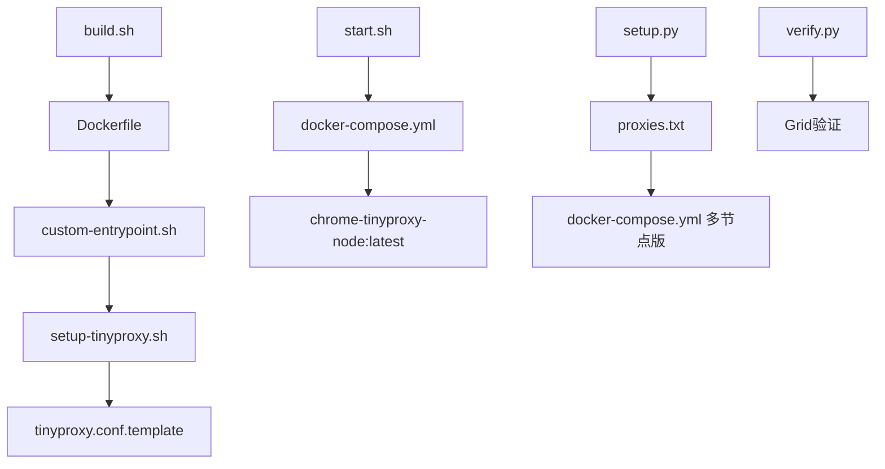

# 📁 代码结构总览

## 🗂️ 文件组织

```
mini/docker/
├── 📋 README.md              # 完整方案文档
├── ⚡ QUICKSTART.md          # 极速开始指南
├── 📊 STRUCTURE.md           # 代码结构说明（本文件）
│
├── 🐳 容器配置
│   ├── Dockerfile            # Chrome节点镜像定义
│   └── docker-compose.yml    # 服务编排配置
│
├── 🔧 启动脚本
│   ├── custom-entrypoint.sh  # 容器入口脚本
│   ├── setup-tinyproxy.sh    # 代理配置脚本
│   └── tinyproxy.conf.template # 代理配置模板
│
├── 🛠️ 管理工具
│   ├── build.sh             # 镜像构建脚本
│   ├── start.sh             # 服务管理脚本
│   └── verify.py            # 验证测试脚本
│
├── 📈 扩展工具
│   ├── setup.py             # 多节点配置生成器
│   └── proxies.txt          # 代理IP列表
│
└── 🗑️ 已清理文件
    ├── test_*.py            # 冗余测试文件（已删除）
    ├── entrypoint.sh        # 旧版入口脚本（已删除）
    └── supervisord.conf     # 旧版进程管理（已删除）
```

## 🔗 文件关系



## 🎯 核心组件

### 1. 容器镜像层
- **Dockerfile**: 基于selenium/node-chrome，添加tinyproxy
- **custom-entrypoint.sh**: 启动代理→设置环境变量→启动selenium

### 2. 代理配置层
- **setup-tinyproxy.sh**: 根据环境变量生成tinyproxy配置
- **tinyproxy.conf.template**: 配置模板，包含upstream占位符

### 3. 服务编排层
- **docker-compose.yml**: Hub+Node服务定义，环境变量配置
- **start.sh**: 一站式服务管理（start/stop/status/logs/test）

### 4. 工具层
- **build.sh**: 文件检查→镜像构建→大小显示
- **verify.py**: 连接Grid→检查IP→测试网站
- **setup.py**: 多节点配置自动生成

## 🧬 数据流

### 启动流程
```
build.sh → 镜像构建 → start.sh → 容器启动 → custom-entrypoint.sh
    ↓
setup-tinyproxy.sh → 配置生成 → tinyproxy启动 → selenium启动
```

### 代理流程
```
用户脚本 → Grid Hub → Chrome容器 → HTTP_PROXY → tinyproxy → 上游代理
```

### 配置流程
```
docker-compose.yml 环境变量 → custom-entrypoint.sh → setup-tinyproxy.sh → tinyproxy.conf
```

## 🏷️ 关键标识

- 🟢 **核心文件**: 必需，不可删除
- 🟡 **工具文件**: 便利工具，可选
- 🟣 **扩展文件**: 多节点功能
- 🔴 **已清理**: 冗余文件已删除

## 📏 复杂度评估

| 文件 | 行数 | 复杂度 | 说明 |
|------|------|--------|------|
| Dockerfile | 25 | 简单 | 标准容器构建 |
| custom-entrypoint.sh | 110 | 中等 | 主要启动逻辑 |
| setup-tinyproxy.sh | 70 | 简单 | 配置生成 |
| docker-compose.yml | 55 | 简单 | 标准编排 |
| start.sh | 350 | 复杂 | 完整管理功能 |
| setup.py | 240 | 复杂 | 多节点生成器 |
| verify.py | 80 | 简单 | 基础验证 |

**总复杂度**: 中等，核心逻辑清晰简洁
