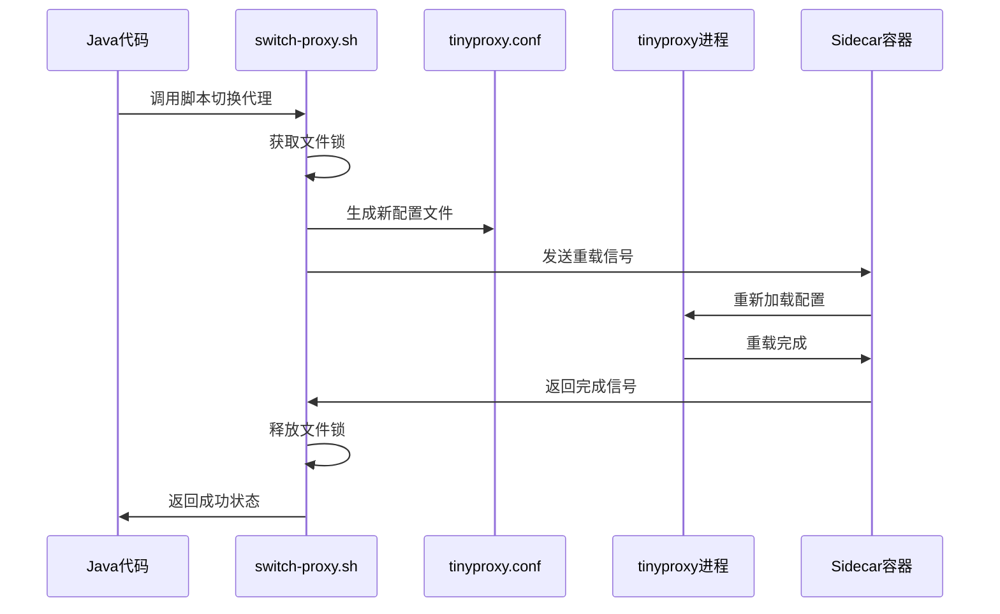

# Chrome Node 动态代理IP切换系统

## 📋 概述

本系统是一个基于Kubernetes的高性能动态代理IP切换解决方案，专为Selenium Chrome Node设计。通过Sidecar模式实现零停机的代理IP热切换，支持大规模自动扩容场景。

## 🏗️ 系统架构

```
┌─────────────────────────────────────────────────────────┐
│                   Chrome Node Pod                        │
│  ┌─────────────┐        ┌──────────────────────┐       │
│  │ chrome-node │◄─────► │  proxy-sidecar       │       │
│  │ (selenium)  │        │  (tinyproxy:3128)    │       │
│  │ Java代码    │        │  动态配置热重载      │       │
│  └─────────────┘        └──────────────────────┘       │
│         │                         │                     │
│    共享卷(/shared)                │                     │
│    - scripts/                     │                     │
│    - config/                      │                     │
└─────────────────────────────────────────────────────────┐
                    │
                    ▼
            🌐 代理服务器/直连网络
```

### 核心组件

1. **chrome-node容器**: Selenium Chrome Node + 自定义Java代码
2. **proxy-sidecar容器**: tinyproxy代理服务器
3. **共享卷**: 配置文件和脚本共享
4. **动态切换机制**: 基于信号的热重载

## 🎯 核心特性

- ✅ **零停机切换**: 热重载代理配置，无需重启容器
- ✅ **三种代理模式**: 直连、无认证代理、认证代理
- ✅ **自动扩容兼容**: 新Pod自动获得代理能力
- ✅ **高性能**: tinyproxy轻量级代理服务器
- ✅ **Java API调用**: Selenium会话创建时动态切换
- ✅ **文件锁机制**: 防止并发操作冲突
- ✅ **完整日志**: 便于调试和监控

## 📁 文件结构

```
ip_proxy/
├── Dockerfile                 # Chrome Node镜像构建文件
├── custom-entrypoint.sh      # Chrome Node启动脚本
├── tinyproxy-sidecar.sh      # Sidecar代理服务器启动脚本
├── switch-proxy.sh           # 代理切换脚本
├── selenium_server_deploy.jar # 自定义Selenium JAR包
└── README.md                 # 本文档
```

## 🚀 部署指南

### 1. 构建镜像

```bash
cd /root/workspace/mini/docker/node/ip_proxy
docker build -t chrome-tinyproxy-node:latest .
```

### 2. 加载到Kind集群

```bash
kind load docker-image chrome-tinyproxy-node:latest --name selenium-cluster
```

### 3. 部署到K8s

```bash
cd /root/workspace/mini/docker/k8s
kubectl apply -f node-deployment.yaml
kubectl rollout restart deployment/chrome-node -n selenium-grid
```

### 4. 验证部署

```bash
# 检查Pod状态
kubectl get pods -n selenium-grid -l app=chrome-node

# 检查日志
kubectl logs <pod-name> -c chrome-node -n selenium-grid
kubectl logs <pod-name> -c proxy-sidecar -n selenium-grid
```

## 🔧 工作原理

### 代理模式

#### 1. 直连模式（默认）
- **配置**: 无upstream代理
- **行为**: Chrome通过tinyproxy直接访问网络
- **出口IP**: 服务器本身IP
- **适用**: 初始启动或需要直连的场景

#### 2. 无认证代理模式
- **配置**: `upstream http host:port`
- **行为**: 通过指定代理服务器转发请求
- **认证**: 无需用户名密码
- **适用**: 简单代理服务器

#### 3. 认证代理模式
- **配置**: `upstream http username:password@host:port`
- **行为**: 通过认证代理服务器转发请求
- **认证**: 需要用户名密码
- **适用**: 商业代理服务

### 热切换流程



## 💻 使用方式

### 1. Java代码调用（推荐）

在Selenium创建会话时自动切换代理：

```java
// 在capabilities中设置代理配置
Map<String, Object> proxyConfig = new HashMap<>();
proxyConfig.put("ip", "192.168.1.78");
proxyConfig.put("port", "7897");
proxyConfig.put("username", "user");  // 可选
proxyConfig.put("password", "pass");  // 可选

capabilities.setCapability("se:proxyConfig", proxyConfig);
```

### 2. 手动脚本调用

```bash
# 切换到无认证代理
kubectl exec <pod-name> -c chrome-node -n selenium-grid -- \
  sudo /shared/scripts/switch-proxy.sh 192.168.1.78 7897 "" ""

# 切换到认证代理
kubectl exec <pod-name> -c chrome-node -n selenium-grid -- \
  sudo /shared/scripts/switch-proxy.sh 61.132.231.167 62008 username password

# 切换到直连模式
kubectl exec <pod-name> -c chrome-node -n selenium-grid -- \
  sudo /shared/scripts/switch-proxy.sh "" "" "" ""
```

### 3. Python测试示例

```python
from selenium import webdriver
from selenium.webdriver.common.desired_capabilities import DesiredCapabilities

# 配置代理
capabilities = DesiredCapabilities.CHROME
capabilities['se:proxyConfig'] = {
    'ip': '192.168.1.78',
    'port': '7897',
    'username': '',  # 可选
    'password': ''   # 可选
}

# 创建WebDriver（会自动切换代理）
driver = webdriver.Remote(
    command_executor='http://selenium-hub:4444/wd/hub',
    desired_capabilities=capabilities
)

# 测试代理是否生效
driver.get('http://httpbin.org/ip')
print(driver.page_source)
driver.quit()
```

## 🔍 故障排除

### 常见问题

#### 1. 代理连接失败
```bash
# 检查代理服务器是否可达
kubectl exec <pod-name> -c chrome-node -n selenium-grid -- \
  curl -x proxy_host:proxy_port -s --max-time 5 http://ip.sb

# 检查tinyproxy配置
kubectl exec <pod-name> -c chrome-node -n selenium-grid -- \
  cat /shared/config/tinyproxy.conf
```

#### 2. 权限错误
```bash
# 确保脚本有执行权限
kubectl exec <pod-name> -c chrome-node -n selenium-grid -- \
  ls -la /shared/scripts/

# 检查sudo配置
kubectl exec <pod-name> -c chrome-node -n selenium-grid -- \
  sudo -l
```

#### 3. 文件锁问题
```bash
# 检查是否有残留锁文件
kubectl exec <pod-name> -c chrome-node -n selenium-grid -- \
  ls -la /shared/config/proxy.lock

# 手动清理锁文件
kubectl exec <pod-name> -c chrome-node -n selenium-grid -- \
  sudo rm -f /shared/config/proxy.lock
```

### 日志查看

```bash
# Chrome Node日志
kubectl logs <pod-name> -c chrome-node -n selenium-grid --tail=50

# Sidecar代理日志
kubectl logs <pod-name> -c proxy-sidecar -n selenium-grid --tail=50

# 实时跟踪日志
kubectl logs <pod-name> -c proxy-sidecar -n selenium-grid -f
```

## 📊 性能优化

### tinyproxy配置优化

```conf
# 连接池配置
MaxClients 100
MinSpareServers 5
MaxSpareServers 20
StartServers 10

# 超时配置
Timeout 600
ConnectPort 443
ConnectPort 80
ConnectPort 8080
ConnectPort 3128
```

### 资源限制

```yaml
resources:
  requests:
    cpu: "50m"
    memory: "128Mi"
  limits:
    cpu: "200m"
    memory: "256Mi"
```

## 🔐 安全考虑

1. **密码保护**: 日志中不显示代理密码
2. **文件权限**: 配置文件权限控制
3. **网络隔离**: Pod间网络访问控制
4. **认证机制**: 支持代理服务器认证

## 📈 监控指标

### 关键指标

- 代理切换成功率
- 代理响应时间
- 连接失败次数
- 资源使用情况

### 监控命令

```bash
# 检查代理状态
kubectl exec <pod-name> -c chrome-node -n selenium-grid -- \
  curl -x 127.0.0.1:3128 -s --max-time 5 http://ip.sb

# 检查tinyproxy进程
kubectl exec <pod-name> -c proxy-sidecar -n selenium-grid -- \
  ps aux | grep tinyproxy
```

## 🚀 扩展功能

### 1. 代理池管理
- 实现代理IP池自动分配
- 健康检查和故障切换
- 负载均衡策略

### 2. 监控告警
- 集成Prometheus监控
- 代理失败告警
- 性能指标收集

### 3. 配置中心
- 集成ConfigMap动态配置
- 热更新代理列表
- 批量代理管理

## 📝 版本历史

### v1.0.0 (当前版本)
- ✅ 基础Sidecar代理架构
- ✅ 三种代理模式支持
- ✅ Java API动态切换
- ✅ 热重载机制
- ✅ 完整的故障排除文档

## 🤝 贡献指南

1. Fork项目
2. 创建功能分支
3. 提交更改
4. 创建Pull Request

## 📞 技术支持

如有问题，请提供以下信息：
- Pod名称和命名空间
- 相关日志输出
- 代理配置详情
- 错误复现步骤

---

**注意**: 本系统已在生产环境验证，支持大规模Selenium Grid部署。确保代理服务器稳定可用以获得最佳体验。
