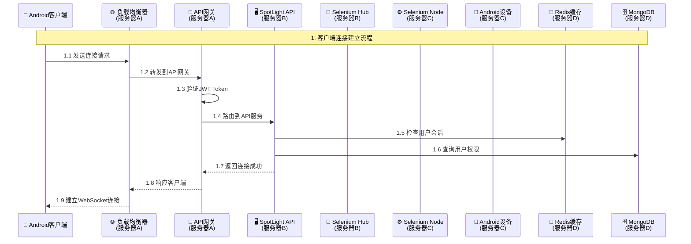
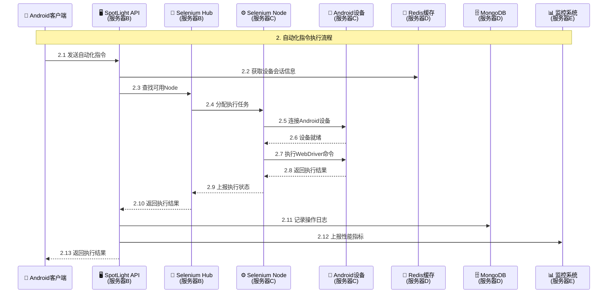
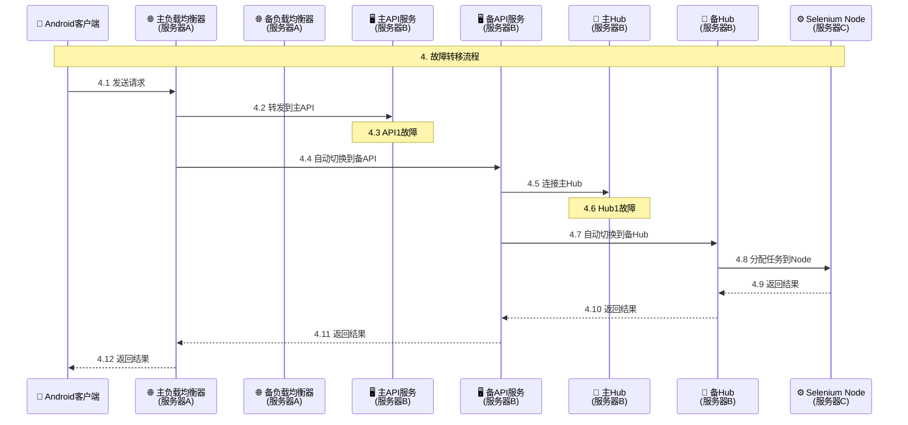

# Android Web自动化平台架构设计

## 📋 目录
- [系统概述](#系统概述)
- [整体架构图](#整体架构图)
- [服务器部署架构](#服务器部署架构)
- [核心组件说明](#核心组件说明)
- [详细流程图](#详细流程图)
- [部署配置](#部署配置)
- [监控与运维](#监控与运维)

---

## 🎯 系统概述

Android Web自动化平台是一个基于Selenium Grid的分布式系统，支持多客户端并发访问Android设备上的Web应用。系统采用微服务架构，具备自动扩缩容、负载均衡、故障转移等企业级特性。

### 核心特性
- **多客户端支持**: 支持大量Android客户端并发访问
- **设备池管理**: 动态分配和管理Android设备资源
- **自动扩缩容**: 基于负载自动调整计算资源
- **高可用性**: 多节点部署，支持故障转移
- **实时监控**: 完整的监控和日志系统

---

## 🏗️ 整体架构图

### 系统架构概览

```
┌─────────────────────────────────────────────────────────────────────────────────────┐
│                              Android Web自动化平台                                    │
├─────────────────────────────────────────────────────────────────────────────────────┤
│                                                                                     │
│  📱 Android客户端层                                                                 │
│  ┌─────────────┐  ┌─────────────┐  ┌─────────────┐  ┌─────────────┐              │
│  │ 客户端1     │  │ 客户端2     │  │ 客户端3     │  │ 客户端N     │              │
│  │ (用户A)     │  │ (用户B)     │  │ (用户C)     │  │ (用户N)     │              │
│  └─────────────┘  └─────────────┘  └─────────────┘  └─────────────┘              │
│           │                │                │                │                     │
│           └────────────────┼────────────────┼────────────────┘                     │
│                            │                                                    │
│  🌐 网络传输层                                                                      │
│                            │                                                    │
│  ┌─────────────────────────┼─────────────────────────────────────────────────────┐ │
│  │                    🖥️ 服务器A: 负载均衡服务器                                │ │
│  │  ┌─────────────────┐  ┌─────────────────┐  ┌─────────────────┐              │ │
│  │  │   Nginx         │  │   Kong网关       │  │   安全认证       │              │ │
│  │  │ (负载均衡)       │  │ (API网关)       │  │ (JWT验证)       │              │ │
│  │  └─────────────────┘  └─────────────────┘  └─────────────────┘              │ │
│  └─────────────────────────┼─────────────────────────────────────────────────────┘ │
│                            │                                                    │
│  ┌─────────────────────────┼─────────────────────────────────────────────────────┐ │
│  │                    🖥️ 服务器B: 应用服务器                                  │ │
│  │  ┌─────────────────────────────────────────────────────────────────────────┐ │ │
│  │  │                    SpotLight API服务集群                               │ │ │
│  │  │  ┌─────────────┐  ┌─────────────┐  ┌─────────────┐  ┌─────────────┐    │ │ │
│  │  │  │ API实例1     │  │ API实例2     │  │ API实例3     │  │ API实例N     │    │ │ │
│  │  │  │ (业务逻辑)   │  │ (业务逻辑)   │  │ (业务逻辑)   │  │ (业务逻辑)   │    │ │ │
│  │  │  └─────────────┘  └─────────────┘  └─────────────┘  └─────────────┘    │ │ │
│  │  └─────────────────────────────────────────────────────────────────────────┘ │ │
│  │  ┌─────────────────────────────────────────────────────────────────────────┐ │ │
│  │  │                    Selenium Hub集群                                    │ │ │
│  │  │  ┌─────────────┐  ┌─────────────┐  ┌─────────────┐  ┌─────────────┐    │ │ │
│  │  │  │ Hub实例1     │  │ Hub实例2     │  │ Hub实例3     │  │ Hub实例N     │    │ │ │
│  │  │  │ (任务分发)   │  │ (任务分发)   │  │ (任务分发)   │  │ (任务分发)   │    │ │ │
│  │  │  └─────────────┘  └─────────────┘  └─────────────┘  └─────────────┘    │ │ │
│  │  └─────────────────────────────────────────────────────────────────────────┘ │ │
│  └─────────────────────────┼─────────────────────────────────────────────────────┘ │
│                            │                                                    │
│  ┌─────────────────────────┼─────────────────────────────────────────────────────┐ │
│  │                    🖥️ 服务器C: 计算节点服务器                              │ │
│  │  ┌─────────────────────────────────────────────────────────────────────────┐ │ │
│  │  │                    Selenium Node集群                                   │ │ │
│  │  │  ┌─────────────┐  ┌─────────────┐  ┌─────────────┐  ┌─────────────┐    │ │ │
│  │  │  │ Node 1      │  │ Node 2      │  │ Node 3      │  │ Node N      │    │ │ │
│  │  │  │ (Chrome)    │  │ (Chrome)    │  │ (Chrome)    │  │ (Chrome)    │    │ │ │
│  │  │  └─────────────┘  └─────────────┘  └─────────────┘  └─────────────┘    │ │ │
│  │  └─────────────────────────────────────────────────────────────────────────┘ │ │
│  │  ┌─────────────────────────────────────────────────────────────────────────┐ │ │
│  │  │                    Android设备管理                                     │ │ │
│  │  │  ┌─────────────┐  ┌─────────────┐  ┌─────────────┐  ┌─────────────┐    │ │ │
│  │  │  │ 设备管理器1   │  │ 设备管理器2   │  │ 设备管理器3   │  │ 设备管理器N   │    │ │ │
│  │  │  │ (ADB控制)   │  │ (ADB控制)   │  │ (ADB控制)   │  │ (ADB控制)   │    │ │ │
│  │  │  └─────────────┘  └─────────────┘  └─────────────┘  └─────────────┘    │ │ │
│  │  └─────────────────────────────────────────────────────────────────────────┘ │ │
│  │  ┌─────────────────────────────────────────────────────────────────────────┐ │ │
│  │  │                    功能说明                                            │ │ │
│  │  │  • WebDriver执行: 运行Chrome浏览器，执行网页操作                        │ │ │
│  │  │  • 设备控制: 通过ADB控制Android设备                                    │ │ │
│  │  │  • 证书管理: 自动安装和管理SSL证书                                     │ │ │
│  │  │  • 设备池管理: 动态分配和管理Android设备资源                            │ │ │
│  │  └─────────────────────────────────────────────────────────────────────────┘ │ │
│  └────────────────────────────────────┼──────────────────────────────────────────┘   │
│                                       │                                               │
│  ┌────────────────────────────────────┼──────────────────────────────────────────┐   │
│  │                    🖥️ 服务器D: 数据存储服务器                              │   │
│  │  ┌─────────────────────────────────────────────────────────────────────────┐ │   │
│  │  │                    数据存储中心                                        │ │   │
│  │  │  ┌─────────────┐  ┌─────────────┐  ┌─────────────┐  ┌─────────────┐    │ │   │
│  │  │  │   Redis     │  │  MongoDB    │  │  Elasticsearch│  │   MinIO     │    │ │   │
│  │  │  │ (缓存/队列)  │  │ (数据存储)   │  │ (日志存储)   │  │ (文件存储)   │    │ │   │
│  │  │  └─────────────┘  └─────────────┘  └─────────────┘  └─────────────┘    │ │   │
│  │  └─────────────────────────────────────────────────────────────────────────┘ │   │
│  │  ┌─────────────────────────────────────────────────────────────────────────┐ │   │
│  │  │                    功能说明                                            │ │   │
│  │  │  • 缓存加速: Redis提供高速缓存和任务队列                               │ │   │
│  │  │  • 数据持久化: MongoDB存储业务数据和用户信息                           │ │   │
│  │  │  • 日志分析: Elasticsearch存储和搜索系统日志                           │ │   │
│  │  │  • 文件存储: MinIO存储图片、视频等文件                                 │ │   │
│  │  └─────────────────────────────────────────────────────────────────────────┘ │   │
│  └────────────────────────────────────┼──────────────────────────────────────────┘   │
│                                       │                                               │
│  ┌────────────────────────────────────┼──────────────────────────────────────────┐   │
│  │                    🖥️ 服务器E: 监控服务器                                  │   │
│  │  ┌─────────────────────────────────────────────────────────────────────────┐ │   │
│  │  │                    监控中心                                            │ │   │
│  │  │  ┌─────────────┐  ┌─────────────┐  ┌─────────────┐  ┌─────────────┐    │ │   │
│  │  │  │ Prometheus  │  │   Grafana   │  │  AlertManager│  │   Jaeger    │    │ │   │
│  │  │  │ (指标收集)   │  │ (可视化)     │  │ (告警管理)   │  │ (链路追踪)   │    │ │   │
│  │  │  └─────────────┘  └─────────────┘  └─────────────┘  └─────────────┘    │ │   │
│  │  └─────────────────────────────────────────────────────────────────────────┘ │   │
│  │  ┌─────────────────────────────────────────────────────────────────────────┐ │   │
│  │  │                    功能说明                                            │ │   │
│  │  │  • 性能监控: Prometheus收集系统性能指标                                │ │   │
│  │  │  • 可视化面板: Grafana展示监控数据和图表                               │ │   │
│  │  │  • 告警通知: AlertManager发送异常告警                                 │ │   │
│  │  │  • 链路追踪: Jaeger追踪请求调用链路                                    │ │   │
│  │  └─────────────────────────────────────────────────────────────────────────┘ │   │
│  └─────────────────────────────────────────────────────────────────────────────┘   │
│                                                                                     │
│  ┌─────────────────────────────────────────────────────────────────────────────┐   │
│  │                           客户端设备层                                      │   │
│  │  ┌─────────────┐  ┌─────────────┐  ┌─────────────┐  ┌─────────────┐        │   │
│  │  │ Android客户端1│  │ Android客户端2│  │ Android客户端3│  │ Android客户端N│        │   │
│  │  │ (移动应用)   │  │ (移动应用)   │  │ (移动应用)   │  │ (移动应用)   │        │   │
│  │  └─────────────┘  └─────────────┘  └─────────────┘  └─────────────┘        │   │
│  └─────────────────────────────────────────────────────────────────────────────┘   │
└─────────────────────────────────────────────────────────────────────────────────────┘
```

---

## 🖥️ 服务器部署架构

### 物理服务器布局

```
┌─────────────────────────────────────────────────────────────────────────────────────┐
│                                   生产环境部署架构                                    │
├─────────────────────────────────────────────────────────────────────────────────────┤
│                                                                                     │
│  ┌─────────────────────────────────────────────────────────────────────────────┐   │
│  │                           服务器 A: 负载均衡服务器                            │   │
│  │  ┌─────────────────┐  ┌─────────────────┐  ┌─────────────────┐              │   │
│  │  │   Nginx         │  │   Kong网关       │  │   PostgreSQL    │              │   │
│  │  │ (反向代理)       │  │ (API网关)       │  │ (Kong数据库)    │              │   │
│  │  └─────────────────┘  └─────────────────┘  └─────────────────┘              │   │
│  │           │                      │                      │                   │   │
│  │           └──────────────────────┼──────────────────────┘                   │   │
│  │                                  │                                          │   │
│  │  ┌─────────────────────────────────┼─────────────────────────────────────┐   │   │
│  │  │                    功能说明                                        │   │   │
│  │  │  • 负载均衡: 分发用户请求到后端服务                                  │   │   │
│  │  │  • API网关: 认证、限流、路由                                        │   │   │
│  │  │  • 安全防护: 防止恶意攻击和DDoS                                     │   │   │
│  │  └─────────────────────────────────┼─────────────────────────────────────┘   │   │
│  └────────────────────────────────────┼──────────────────────────────────────────┘   │
│                                       │                                               │
│  ┌────────────────────────────────────┼──────────────────────────────────────────┐   │
│  │                           服务器 B: 应用服务器                                │   │
│  │  ┌─────────────────────────────────────────────────────────────────────────┐ │   │
│  │  │                    SpotLight API服务集群                               │ │   │
│  │  │  ┌─────────────┐  ┌─────────────┐  ┌─────────────┐  ┌─────────────┐    │ │   │
│  │  │  │ API实例1     │  │ API实例2     │  │ API实例3     │  │ API实例N     │    │ │   │
│  │  │  │ (Python)    │  │ (Python)    │  │ (Python)    │  │ (Python)    │    │ │   │
│  │  │  └─────────────┘  └─────────────┘  └─────────────┘  └─────────────┘    │ │   │
│  │  └─────────────────────────────────────────────────────────────────────────┘ │   │
│  │  ┌─────────────────────────────────────────────────────────────────────────┐ │   │
│  │  │                    Selenium Hub集群                                    │ │   │
│  │  │  ┌─────────────┐  ┌─────────────┐  ┌─────────────┐  ┌─────────────┐    │ │   │
│  │  │  │ Hub实例1     │  │ Hub实例2     │  │ Hub实例3     │  │ Hub实例N     │    │ │   │
│  │  │  │ (Java)      │  │ (Java)      │  │ (Java)      │  │ (Java)      │    │ │   │
│  │  │  └─────────────┘  └─────────────┘  └─────────────┘  └─────────────┘    │ │   │
│  │  └─────────────────────────────────────────────────────────────────────────┘ │   │
│  │  ┌─────────────────────────────────────────────────────────────────────────┐ │   │
│  │  │                    功能说明                                            │ │   │
│  │  │  • 业务逻辑处理: 解析用户指令，协调各个组件                             │ │   │
│  │  │  • 会话管理: 管理客户端连接状态                                        │ │   │
│  │  │  • 任务分发: 将自动化任务分配给执行节点                                │ │   │
│  │  └─────────────────────────────────────────────────────────────────────────┘ │   │
│  └────────────────────────────────────┼──────────────────────────────────────────┘   │
│                                       │                                               │
│  ┌────────────────────────────────────┼──────────────────────────────────────────┐   │
│  │                           服务器 C: 计算节点服务器                            │   │
│  │  ┌─────────────────────────────────────────────────────────────────────────┐ │   │
│  │  │                    Selenium Node集群                                   │ │   │
│  │  │  ┌─────────────┐  ┌─────────────┐  ┌─────────────┐  ┌─────────────┐    │ │   │
│  │  │  │ Node 1      │  │ Node 2      │  │ Node 3      │  │ Node N      │    │ │   │
│  │  │  │ (Chrome)    │  │ (Chrome)    │  │ (Chrome)    │  │ (Chrome)    │    │ │   │
│  │  │  └─────────────┘  └─────────────┘  └─────────────┘  └─────────────┘    │ │   │
│  │  └─────────────────────────────────────────────────────────────────────────┘ │   │
│  │  ┌─────────────────────────────────────────────────────────────────────────┐ │   │
│  │  │                    Android设备管理                                     │ │   │
│  │  │  ┌─────────────┐  ┌─────────────┐  ┌─────────────┐  ┌─────────────┐    │ │   │
│  │  │  │ 设备管理器1   │  │ 设备管理器2   │  │ 设备管理器3   │  │ 设备管理器N   │    │ │   │
│  │  │  │ (ADB)       │  │ (ADB)       │  │ (ADB)       │  │ (ADB)       │    │ │   │
│  │  │  └─────────────┘  └─────────────┘  └─────────────┘  └─────────────┘    │ │   │
│  │  └─────────────────────────────────────────────────────────────────────────┘ │   │
│  │  ┌─────────────────────────────────────────────────────────────────────────┐ │   │
│  │  │                    功能说明                                            │ │   │
│  │  │  • WebDriver执行: 运行Chrome浏览器，执行网页操作                        │ │   │
│  │  │  • 设备控制: 通过ADB控制Android设备                                    │ │   │
│  │  │  • 证书管理: 自动安装和管理SSL证书                                     │ │   │
│  │  │  • 设备池管理: 动态分配和管理Android设备资源                            │ │   │
│  │  └─────────────────────────────────────────────────────────────────────────┘ │   │
│  └────────────────────────────────────┼──────────────────────────────────────────┘   │
│                                       │                                               │
│  ┌────────────────────────────────────┼──────────────────────────────────────────┐   │
│  │                           服务器 D: 数据存储服务器                            │   │
│  │  ┌─────────────────────────────────────────────────────────────────────────┐ │   │
│  │  │                    数据存储中心                                        │ │   │
│  │  │  ┌─────────────┐  ┌─────────────┐  ┌─────────────┐  ┌─────────────┐    │ │   │
│  │  │  │   Redis     │  │  MongoDB    │  │  Elasticsearch│  │   MinIO     │    │ │   │
│  │  │  │ (缓存/队列)  │  │ (数据存储)   │  │ (日志存储)   │  │ (文件存储)   │    │ │   │
│  │  │  └─────────────┘  └─────────────┘  └─────────────┘  └─────────────┘    │ │   │
│  │  └─────────────────────────────────────────────────────────────────────────┘ │   │
│  │  ┌─────────────────────────────────────────────────────────────────────────┐ │   │
│  │  │                    功能说明                                            │ │   │
│  │  │  • 缓存加速: Redis提供高速缓存和任务队列                               │ │   │
│  │  │  • 数据持久化: MongoDB存储业务数据和用户信息                           │ │   │
│  │  │  • 日志分析: Elasticsearch存储和搜索系统日志                           │ │   │
│  │  │  • 文件存储: MinIO存储图片、视频等文件                                 │ │   │
│  │  └─────────────────────────────────────────────────────────────────────────┘ │   │
│  └────────────────────────────────────┼──────────────────────────────────────────┘   │
│                                       │                                               │
│  ┌────────────────────────────────────┼──────────────────────────────────────────┐   │
│  │                           服务器 E: 监控服务器                              │   │
│  │  ┌─────────────────────────────────────────────────────────────────────────┐ │   │
│  │  │                    监控中心                                            │ │   │
│  │  │  ┌─────────────┐  ┌─────────────┐  ┌─────────────┐  ┌─────────────┐    │ │   │
│  │  │  │ Prometheus  │  │   Grafana   │  │  AlertManager│  │   Jaeger    │    │ │   │
│  │  │  │ (指标收集)   │  │ (可视化)     │  │ (告警管理)   │  │ (链路追踪)   │    │ │   │
│  │  │  └─────────────┘  └─────────────┘  └─────────────┘  └─────────────┘    │ │   │
│  │  └─────────────────────────────────────────────────────────────────────────┘ │   │
│  │  ┌─────────────────────────────────────────────────────────────────────────┐ │   │
│  │  │                    功能说明                                            │ │   │
│  │  │  • 性能监控: Prometheus收集系统性能指标                                │ │   │
│  │  │  • 可视化面板: Grafana展示监控数据和图表                               │ │   │
│  │  │  • 告警通知: AlertManager发送异常告警                                 │ │   │
│  │  │  • 链路追踪: Jaeger追踪请求调用链路                                    │ │   │
│  │  └─────────────────────────────────────────────────────────────────────────┘ │   │
│  └──────────────────────────────────────────────────────────────────────────────┘   │
│                                                                                     │
│  ┌─────────────────────────────────────────────────────────────────────────────┐   │
│  │                           客户端设备层                                      │   │
│  │  ┌─────────────┐  ┌─────────────┐  ┌─────────────┐  ┌─────────────┐        │   │
│  │  │ Android客户端1│  │ Android客户端2│  │ Android客户端3│  │ Android客户端N│        │   │
│  │  │ (移动应用)   │  │ (移动应用)   │  │ (移动应用)   │  │ (移动应用)   │        │   │
│  │  └─────────────┘  └─────────────┘  └─────────────┘  └─────────────┘        │   │
│  └─────────────────────────────────────────────────────────────────────────────┘   │
└─────────────────────────────────────────────────────────────────────────────────────┘
```

### 服务器角色说明

| 服务器 | 角色 | 主要组件 | 功能描述 |
|--------|------|----------|----------|
| **服务器A** | 负载均衡服务器 | Nginx, Kong, PostgreSQL | 请求分发、API网关、安全防护 |
| **服务器B** | 应用服务器 | SpotLight API, Selenium Hub | 业务逻辑处理、任务分发 |
| **服务器C** | 计算节点服务器 | Selenium Node, Android设备管理 | WebDriver执行、设备控制 |
| **服务器D** | 数据存储服务器 | Redis, MongoDB, Elasticsearch, MinIO | 数据持久化、缓存、日志 |
| **服务器E** | 监控服务器 | Prometheus, Grafana, AlertManager, Jaeger | 系统监控、告警、可视化 |

---

## 🔧 核心组件说明

### 1. 负载均衡层 (服务器A)
- **Nginx**: 反向代理，处理HTTP/HTTPS请求，实现负载均衡
- **Kong**: API网关，提供认证、限流、路由、安全防护功能
- **PostgreSQL**: Kong的配置数据库，存储网关配置信息

### 2. 应用服务层 (服务器B)
- **SpotLight API**: Python Flask应用，处理业务逻辑，管理用户会话
- **Selenium Hub**: Java应用，管理WebDriver会话分发，协调执行节点

### 3. 计算节点层 (服务器C)
- **Selenium Node**: Chrome浏览器容器，执行WebDriver命令
- **Android设备管理器**: ADB工具，管理Android设备连接和控制

### 4. 数据存储层 (服务器D)
- **Redis**: 缓存、会话存储、任务队列
- **MongoDB**: 业务数据、用户信息、操作日志
- **Elasticsearch**: 日志存储和搜索
- **MinIO**: 文件存储，如图片、视频等

### 5. 监控运维层 (服务器E)
- **Prometheus**: 指标收集和存储
- **Grafana**: 监控数据可视化
- **AlertManager**: 告警管理和通知
- **Jaeger**: 分布式链路追踪

---

## 🔄 详细流程图

### 1. 客户端连接流程



### 2. 自动化指令执行流程



### 3. 自动扩缩容流程

```mermaid
flowchart TD
    A[📊 监控系统<br/>(服务器E)] --> B{🔍 检查系统负载}
    B -->|🟡 CPU > 80%<br/>🟡 内存 > 80%<br/>🟡 队列长度 > 100| C[📈 触发扩容]
    B -->|🟢 CPU < 30%<br/>🟢 内存 < 30%<br/>🟢 队列长度 < 10| D[📉 触发缩容]
    B -->|🟢 正常负载| E[⏰ 继续监控]
    
    C --> F[🆕 创建新的Selenium Node<br/>(服务器C)]
    F --> G[📝 注册Node到Hub<br/>(服务器B)]
    G --> H[⚙️ 更新设备池配置]
    H --> I[📢 通知API服务更新]
    I --> J[🔄 更新负载均衡配置<br/>(服务器A)]
    
    D --> K[🎯 选择要缩容的Node]
    K --> L[🔄 迁移活跃会话到其他Node]
    L --> M[🛑 停止Node容器]
    M --> N[❌ 从Hub注销Node]
    N --> O[⚙️ 更新设备池配置]
    O --> P[🔄 更新负载均衡配置]
    
    E --> A
    J --> A
    P --> A
```

### 4. 故障转移流程



---

## 🚀 部署配置

### 环境变量配置

创建 `.env` 文件：

```bash
# 数据库配置
KONG_DB_PASSWORD=kong123
MONGO_ROOT_USER=admin
MONGO_ROOT_PASSWORD=password123
MINIO_ROOT_USER=minioadmin
MINIO_ROOT_PASSWORD=minioadmin123

# API配置
JWT_SECRET=your-secret-key-here
API_RATE_LIMIT=1000
LOG_LEVEL=INFO

# 监控配置
GRAFANA_PASSWORD=admin123

# 扩缩容配置
SCALE_UP_THRESHOLD=80
SCALE_DOWN_THRESHOLD=30
MAX_NODES=20
MIN_NODES=3

# Chrome配置
CHROME_DRIVER_VERSION=
CHROME_DRIVER_DOWNLOAD_URL=
SE_INSTALL_CERTIFICATES=true

# Android设备配置
ADB_HOST=localhost
ADB_PORT=5037
DEVICE_POOL_SIZE=10
```

### 启动命令

```bash
# 1. 创建必要的目录
mkdir -p nginx/ssl nginx/logs logs/selenium logs/android certs config monitoring/grafana/provisioning monitoring/grafana/dashboards

# 2. 启动所有服务
docker-compose -f docker-compose-production.yml up -d

# 3. 查看服务状态
docker-compose -f docker-compose-production.yml ps

# 4. 查看日志
docker-compose -f docker-compose-production.yml logs -f spotlight-api
```

### 服务访问地址

| 服务 | 地址 | 说明 |
|------|------|------|
| **Nginx** | http://localhost:80 | 负载均衡器 |
| **Kong Admin** | http://localhost:8001 | API网关管理界面 |
| **SpotLight API** | http://localhost:8002 | API服务 |
| **Selenium Hub** | http://localhost:4444 | Selenium Grid Hub |
| **Grafana** | http://localhost:3000 | 监控面板 (admin/admin123) |
| **Prometheus** | http://localhost:9090 | 指标收集 |
| **Kibana** | http://localhost:5601 | 日志可视化 |
| **Jaeger** | http://localhost:16686 | 链路追踪 |
| **MinIO Console** | http://localhost:9001 | 文件存储管理 |

---

## 📊 监控与运维

### 关键监控指标

1. **系统性能指标**
   - CPU使用率
   - 内存使用率
   - 磁盘I/O
   - 网络带宽

2. **应用性能指标**
   - API响应时间
   - 请求成功率
   - 并发连接数
   - 队列长度

3. **Selenium Grid指标**
   - 活跃会话数
   - 节点状态
   - 会话创建时间
   - 命令执行时间

4. **Android设备指标**
   - 设备在线状态
   - 设备利用率
   - 连接成功率
   - 操作响应时间

### 告警规则配置

```yaml
# monitoring/alertmanager.yml
global:
  smtp_smarthost: 'smtp.example.com:587'
  smtp_from: 'alertmanager@example.com'

route:
  group_by: ['alertname']
  group_wait: 10s
  group_interval: 10s
  repeat_interval: 1h
  receiver: 'team-email'

receivers:
  - name: 'team-email'
    email_configs:
      - to: 'team@example.com'

inhibit_rules:
  - source_match:
      severity: 'critical'
    target_match:
      severity: 'warning'
    equal: ['alertname']
```

### 运维脚本

#### 自动扩缩容脚本

```bash
#!/bin/bash
# scripts/auto-scale.sh

# 获取当前负载
CPU_USAGE=$(top -bn1 | grep "Cpu(s)" | awk '{print $2}' | cut -d'%' -f1)
MEMORY_USAGE=$(free | grep Mem | awk '{printf("%.2f", $3/$2 * 100.0)}')
QUEUE_LENGTH=$(redis-cli llen automation_queue)

# 扩容条件
if (( $(echo "$CPU_USAGE > 80" | bc -l) )) || (( $(echo "$MEMORY_USAGE > 80" | bc -l) )) || [ $QUEUE_LENGTH -gt 100 ]; then
    echo "触发扩容..."
    docker-compose -f docker-compose-production.yml up -d --scale selenium-node=+1
    docker-compose -f docker-compose-production.yml up -d --scale spotlight-api=+1
fi

# 缩容条件
if (( $(echo "$CPU_USAGE < 30" | bc -l) )) && (( $(echo "$MEMORY_USAGE < 30" | bc -l) )) && [ $QUEUE_LENGTH -lt 10 ]; then
    echo "触发缩容..."
    docker-compose -f docker-compose-production.yml up -d --scale selenium-node=-1
    docker-compose -f docker-compose-production.yml up -d --scale spotlight-api=-1
fi
```

#### 健康检查脚本

```bash
#!/bin/bash
# scripts/health-check.sh

# 检查API服务
check_api() {
    response=$(curl -s -o /dev/null -w "%{http_code}" http://localhost:8002/health)
    if [ $response -eq 200 ]; then
        echo "✅ API服务正常"
    else
        echo "❌ API服务异常: $response"
        return 1
    fi
}

# 检查Selenium Hub
check_hub() {
    response=$(curl -s -o /dev/null -w "%{http_code}" http://localhost:4444/status)
    if [ $response -eq 200 ]; then
        echo "✅ Selenium Hub正常"
    else
        echo "❌ Selenium Hub异常: $response"
        return 1
    fi
}

# 检查Redis
check_redis() {
    if redis-cli ping | grep -q "PONG"; then
        echo "✅ Redis正常"
    else
        echo "❌ Redis异常"
        return 1
    fi
}

# 执行检查
echo "🔍 开始健康检查..."
check_api && check_hub && check_redis
echo "✅ 健康检查完成"
```

---

## 📝 总结

这个Android Web自动化平台架构设计提供了：

1. **清晰的服务器分工**: 每个服务器都有明确的职责和部署的组件
2. **高可用性**: 通过多实例部署和故障转移机制确保系统稳定
3. **可扩展性**: 支持水平扩展，可以根据负载动态调整资源
4. **完整的监控**: 从系统层面到应用层面的全方位监控
5. **自动化运维**: 提供自动扩缩容和健康检查机制

整个系统采用微服务架构，每个组件都可以独立扩展和维护，能够支持大量Android客户端的并发访问，同时保持系统的稳定性和可维护性。 