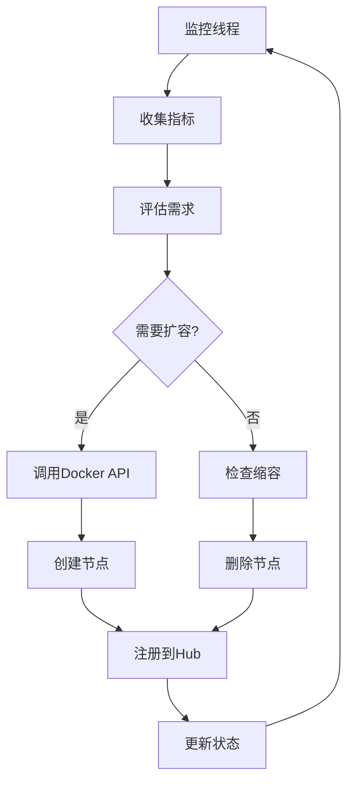

# SpotLight 自动扩容使用指南

## 概述

SpotLight平台实现了完整的自动扩缩容功能，能够根据系统负载动态调整Selenium节点数量，确保服务性能和资源利用率的最优化。

## 架构设计

### 核心组件

1. **Auto Scaler (auto_scaler.py)**
   - 监控系统指标
   - 智能扩容决策
   - 扩容历史管理

2. **Scale Manager (scale_manager.py)**
   - Docker容器管理
   - 节点生命周期控制
   - 资源监控

3. **Metrics Collector (metrics_collector.py)**
   - 系统指标收集
   - 性能监控
   - 统计分析

### 扩容流程



## 配置参数

### 扩容配置 (ScalingConfig)

```python
@dataclass
class ScalingConfig:
    min_nodes: int = 2              # 最小节点数
    max_nodes: int = 20             # 最大节点数
    target_cpu_usage: float = 70.0  # CPU使用率阈值
    target_memory_usage: float = 80.0  # 内存使用率阈值
    target_response_time: float = 2.0  # 响应时间阈值
    scale_up_threshold: int = 5     # 扩容会话数阈值
    scale_down_threshold: int = 2   # 缩容会话数阈值
    cooldown_period: int = 300      # 冷却期(秒)
    check_interval: int = 30        # 检查间隔(秒)
```

### 扩容触发条件

#### 扩容触发
- 活跃会话数 ≥ 5
- CPU使用率 > 70%
- 内存使用率 > 80%
- 响应时间 > 2秒
- 队列长度 > 0

#### 缩容触发
- 活跃会话数 ≤ 2
- CPU使用率 < 35%
- 内存使用率 < 40%
- 队列长度为0
- 当前节点数 > 最小节点数

## API接口

### 1. 扩缩容操作

```http
POST /scale/nodes
Content-Type: application/json

{
    "action": "scale_up",
    "target_nodes": 5,
    "current_nodes": 3,
    "reason": "高负载扩容"
}
```

**响应示例：**
```json
{
    "code": 0,
    "message": "扩容成功: 3 -> 5 节点",
    "data": {
        "action": "scale_up",
        "target_nodes": 5
    }
}
```

### 2. 获取扩缩容状态

```http
GET /scale/status
```

**响应示例：**
```json
{
    "code": 0,
    "message": "success",
    "data": {
        "current_nodes": 3,
        "total_sessions": 8,
        "avg_cpu_usage": 45.2,
        "avg_memory_usage": 62.1,
        "nodes": [
            {
                "name": "selenium-node-chrome-1",
                "status": "Up 2 hours",
                "sessions": 3,
                "cpu_usage": 48.5,
                "memory_usage": 65.2
            }
        ]
    }
}
```

### 3. 清理失败节点

```http
POST /scale/cleanup
```

**响应示例：**
```json
{
    "code": 0,
    "message": "清理完成",
    "data": {
        "cleaned_count": 2
    }
}
```

## 使用方法

### 1. 启动自动扩容

自动扩容在API服务启动时自动启用：

```python
# 在server.py中
auto_scaler = SpotLightAutoScaler()
auto_scaler.start_monitoring()
```

### 2. 手动扩容

```bash
# 扩容2个节点
curl -X POST http://localhost:8002/scale/nodes \
  -H "Content-Type: application/json" \
  -d '{"action": "scale_up", "target_nodes": 5, "current_nodes": 3}'

# 缩容1个节点
curl -X POST http://localhost:8002/scale/nodes \
  -H "Content-Type: application/json" \
  -d '{"action": "scale_down", "target_nodes": 2, "current_nodes": 3}'
```

### 3. 监控状态

```bash
# 查看扩缩容状态
curl http://localhost:8002/scale/status

# 查看Grid指标
curl http://localhost:8002/metrics/grid

# 健康检查
curl http://localhost:8002/health
```

### 4. 清理维护

```bash
# 清理失败的节点
curl -X POST http://localhost:8002/scale/cleanup
```

## 监控和日志

### 日志配置

自动扩容相关的日志会记录到以下模块：
- `hybrid_driver.auto_scaler`
- `hybrid_driver.scale_manager`
- `hybrid_driver.metrics_collector`

### 关键日志示例

```
2025-07-01 10:30:15.123 | INFO | auto_scaler:_evaluate_scaling:198 - 评估扩容需求: CPU=75.2%, Memory=68.1%, Sessions=6
2025-07-01 10:30:15.124 | INFO | auto_scaler:_scale_up:255 - 开始扩容: 3 -> 5 节点
2025-07-01 10:30:25.456 | INFO | scale_manager:_create_node:145 - 节点 selenium-node-chrome-4 创建成功
2025-07-01 10:30:35.789 | INFO | auto_scaler:_scale_up:275 - 扩容成功: 3 -> 5 节点
```

## 故障排查

### 常见问题

1. **扩容失败**
   - 检查Docker服务状态
   - 确认网络配置正确
   - 查看容器日志

2. **节点无法注册**
   - 检查Hub服务状态
   - 确认网络连通性
   - 验证环境变量配置

3. **指标收集异常**
   - 检查Grid API可访问性
   - 确认权限配置
   - 查看网络连接

### 调试命令

```bash
# 查看所有节点状态
docker ps --filter "name=selenium-node-"

# 查看节点日志
docker logs selenium-node-chrome-1

# 检查网络配置
docker network ls
docker network inspect spotlight-network

# 查看Hub状态
curl http://localhost:4444/wd/hub/status
```

## 性能优化

### 1. 资源配置

```yaml
# docker-compose.yml 中的节点配置
selenium-node-chrome:
  deploy:
    resources:
      limits:
        memory: 2G
        cpus: '1.0'
      reservations:
        memory: 1G
        cpus: '0.5'
```

### 2. 扩容策略优化

- 根据实际负载调整阈值
- 设置合理的冷却期避免频繁扩容
- 监控扩容效果并调整参数

### 3. 监控告警

建议配置以下监控指标：
- 节点数量变化
- 扩容失败率
- 资源使用率
- 响应时间趋势

## 最佳实践

1. **渐进式扩容**：避免一次性扩容过多节点
2. **资源预留**：为扩容预留足够的系统资源
3. **定期清理**：定期清理失败的节点
4. **监控告警**：设置扩容异常的告警机制
5. **测试验证**：在生产环境部署前充分测试

## 扩展功能

### 1. 自定义扩容策略

可以通过继承`SpotLightAutoScaler`类来实现自定义的扩容策略：

```python
class CustomAutoScaler(SpotLightAutoScaler):
    def _evaluate_scaling(self, metrics: ScalingMetrics) -> Optional[str]:
        # 实现自定义的扩容逻辑
        pass
```

### 2. 多区域扩容

支持跨多个Docker Swarm节点进行扩容：

```python
scale_manager = DockerScaleManager(
    node_image="selenium/node-chrome:4.33.0-20250606",
    hub_host="selenium-hub",
    network_name="spotlight-network"
)
```

### 3. 指标集成

可以将扩容指标集成到Prometheus、Grafana等监控系统：

```python
# 导出Prometheus指标
from prometheus_client import Counter, Gauge, Histogram

scaling_operations = Counter('scaling_operations_total', 'Total scaling operations')
current_nodes = Gauge('current_nodes', 'Current number of nodes')
``` 