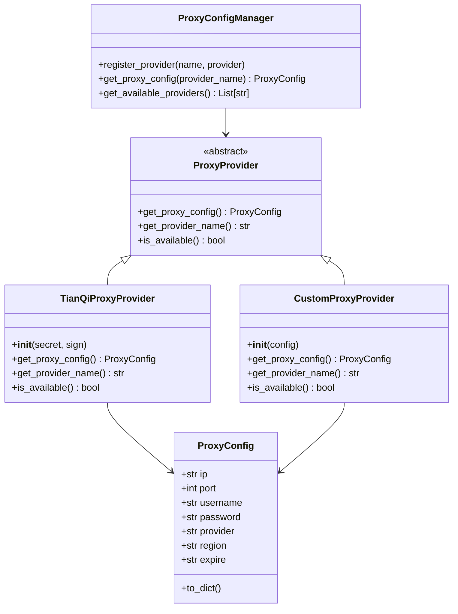

# 🔧 代理配置系统 (Proxy Configuration System)

基于SOLID原则设计的可扩展代理配置系统，支持多种代理数据源，提供统一的接口供Selenium使用。

## 📋 核心特性

- ✅ **符合SOLID原则**: 单一职责、开闭原则、依赖倒置等
- ✅ **可扩展设计**: 轻松添加新的代理提供者
- ✅ **统一接口**: 所有代理提供者返回相同的数据格式
- ✅ **错误处理**: 完善的异常处理和日志记录
- ✅ **类型安全**: 使用Pydantic模型和类型注解

## 🏗️ 架构设计

### 核心组件

1. **ProxyConfig**: 代理配置数据类
2. **ProxyProvider**: 代理提供者抽象基类
3. **ProxyConfigManager**: 代理配置管理器（工厂模式）
4. **具体实现类**: 各种代理提供者实现

### 类图



## 🚀 使用方法

### 1. 基本使用

```python
from hybrid_driver.proxy import get_proxy_config_for_selenium, ProxyProviderNames

# 推荐方式：使用常量（避免拼写错误）
proxy_config = get_proxy_config_for_selenium(ProxyProviderNames.TIANQI)
proxy_config = get_proxy_config_for_selenium(ProxyProviderNames.JULIANG)

# 传统方式：直接使用字符串（仍然支持）
proxy_config = get_proxy_config_for_selenium("tianqi")
proxy_config = get_proxy_config_for_selenium("juliang")

if proxy_config:
    # 配置Selenium代理
    chrome_options.set_capability("se:proxyConfig", proxy_config)
    print(f"使用代理: {proxy_config['ip']}:{proxy_config['port']}")
```

### 1.1 可用常量

```python
from hybrid_driver.proxy import ProxyProviderNames

# 可用的代理提供者常量
ProxyProviderNames.TIANQI   # "tianqi" - 天启代理
ProxyProviderNames.JULIANG  # "juliang" - 巨量代理  
ProxyProviderNames.CUSTOM   # "custom" - 自定义代理
```

### 2. 添加新的代理提供者

```python
from hybrid_driver.proxy.proxy_provider import proxy_manager, ProxyProvider, ProxyConfig

class MyProxyProvider(ProxyProvider):
    def __init__(self, api_key: str):
        self.api_key = api_key
        self.provider_name = "my_provider"

    def get_proxy_config(self) -> Optional[ProxyConfig]:
        # 实现你的代理获取逻辑
        try:
            # 调用你的API
            response = requests.get("https://my-api.com/proxy", headers={"Authorization": self.api_key})
            data = response.json()

            return ProxyConfig(
                ip=data["ip"],
                port=data["port"],
                username=data["username"],
                password=data["password"],
                provider=self.provider_name,
                region=data.get("region", ""),
                expire=data.get("expire", "")
            )
        except Exception as e:
            logger.error(f"获取代理失败: {e}")
            return None

    def get_provider_name(self) -> str:
        return self.provider_name

    def is_available(self) -> bool:
        # 检查服务是否可用
        try:
            response = requests.get("https://my-api.com/health", timeout=5)
            return response.status_code == 200
        except:
            return False

# 注册新的代理提供者
my_provider = MyProxyProvider("your-api-key")
proxy_manager.register_provider("my_provider", my_provider)

# 使用新的代理提供者
config = get_proxy_config_for_selenium("my_provider")
```

### 3. 获取可用提供者

```python
from hybrid_driver.proxy.proxy_provider import proxy_manager

# 获取所有可用的代理提供者
available_providers = proxy_manager.get_available_providers()
print(f"可用代理提供者: {available_providers}")

# 自动选择第一个可用的提供者
for provider_name in available_providers:
    config = proxy_manager.get_proxy_config(provider_name)
    if config:
        print(f"使用提供者: {provider_name}")
        break
```

## 📁 文件结构

```
proxy/
├── proxy_provider.py          # 核心代理配置系统
├── example_new_provider.py    # 新代理提供者示例
└── README.md                  # 本文档
```

## 🔧 内置代理提供者

### TianQiProxyProvider (天启代理)

天启API响应格式：
```json
{
  "code": 1000,
  "data": [
    {
      "ip": "180.158.115.19",
      "port": 40007,
      "prov": "上海",
      "city": "上海",
      "isp": "电信",
      "expire": "2025-09-20 14:27:34"
    }
  ]
}
```

使用方式：
```python
# 使用默认配置（当前项目的密钥）
provider = TianQiProxyProvider()

# 自定义配置
provider = TianQiProxyProvider(
    secret="your-secret",
    sign="your-sign"
)
```

### JuLiangProxyProvider (巨量代理)

巨量API响应格式：
```json
{
  "code": 200,
  "msg": "成功",
  "data": {
    "count": 1,
    "filter_count": 1,
    "surplus_quantity": 995,
    "proxy_list": [
      {
        "http_pass": "185030703172353",
        "http_user": "29f371b48a2f1720",
        "ip": "103.43.135.6",
        "ip_remain": 180,
        "port": "44405",
        "real_ip": "1.203.85.209"
      }
    ]
  }
}
```

使用方式：
```python
# 使用默认配置（当前项目的密钥）
provider = JuLiangProxyProvider()

# 自定义配置
provider = JuLiangProxyProvider(
    trade_no="your_trade_no",
    sign="your_sign"
)
```

### CustomProxyProvider (自定义代理)

```python
# 基础自定义代理提供者
provider = CustomProxyProvider({"name": "custom"})
```

## 🏭 扩展代理提供者示例

### 1. API代理提供者

```python
class MyAPIProxyProvider(ProxyProvider):
    def __init__(self, base_url: str, api_key: str):
        self.base_url = base_url
        self.api_key = api_key
        self.provider_name = "my_api"

    def get_proxy_config(self) -> Optional[ProxyConfig]:
        response = requests.get(
            f"{self.base_url}/proxy",
            headers={"Authorization": f"Bearer {self.api_key}"}
        )
        data = response.json()

        return ProxyConfig(
            ip=data["ip"],
            port=data["port"],
            username=data["username"],
            password=data["password"],
            provider=self.provider_name,
            region=data.get("region", "")
        )
```

### 2. 数据库代理提供者

```python
class DatabaseProxyProvider(ProxyProvider):
    def __init__(self, db_config: Dict[str, Any]):
        self.db_config = db_config
        self.provider_name = "database"

    def get_proxy_config(self) -> Optional[ProxyConfig]:
        # 从数据库查询可用代理
        proxy_data = self._query_database()
        return ProxyConfig(**proxy_data) if proxy_data else None
```

### 3. 配置文件代理提供者

```python
class ConfigFileProxyProvider(ProxyProvider):
    def __init__(self, config_file: str = "proxy.json"):
        self.config_file = config_file
        self.provider_name = "config_file"

    def get_proxy_config(self) -> Optional[ProxyConfig]:
        with open(self.config_file) as f:
            data = json.load(f)
        return ProxyConfig(**data["proxy"])
```

## ✅ SOLID原则实现

### 1. 单一职责原则 (SRP)
- `ProxyConfig`: 只负责存储代理配置数据
- `ProxyProvider`: 只负责获取代理配置
- `ProxyConfigManager`: 只负责管理代理提供者

### 2. 开放封闭原则 (OCP)
- 通过抽象基类`ProxyProvider`实现
- 新增代理提供者无需修改现有代码
- 扩展性好，修改性小

### 3. 里氏替换原则 (LSP)
- 所有`ProxyProvider`实现类可以互换使用
- 客户端代码无需知道具体实现

### 4. 接口隔离原则 (ISP)
- `ProxyProvider`接口只包含必要方法
- 客户端只依赖需要的方法

### 5. 依赖倒置原则 (DIP)
- 高层模块依赖抽象接口
- 具体实现通过依赖注入

## 📊 性能特点

- ✅ **快速失败**: 不可用提供者快速跳过
- ✅ **错误处理**: 完善的异常处理机制
- ✅ **日志记录**: 详细的操作日志
- ✅ **类型安全**: 完整的类型注解

## 🧪 测试示例

```python
# 测试代理配置系统
from hybrid_driver.proxy.proxy_provider import proxy_manager, TianQiProxyProvider

def test_proxy_system():
    # 注册提供者
    tianqi = TianQiProxyProvider()
    proxy_manager.register_provider("tianqi", tianqi)

    # 测试获取配置
    config = proxy_manager.get_proxy_config("tianqi")
    assert config is not None
    assert config.ip and config.port
    assert config.username and config.password

    # 测试提供者名称
    assert tianqi.get_provider_name() == "tianqi"

    # 测试可用性检查
    assert tianqi.is_available()

    print("✅ 代理配置系统测试通过")
```

## 🔄 迁移指南

### 从旧版本迁移

```python
# 旧版本代码
proxy_ip_info = get_proxy_ip()
proxy_credentials = get_proxy_credentials()

if proxy_ip_info:
    chrome_options.set_capability("se:proxyConfig", {
        "ip": proxy_ip_info["ip"],
        "port": proxy_ip_info["port"],
        "username": proxy_credentials["username"],
        "password": proxy_credentials["password"]
    })

# 新版本代码
from hybrid_driver.proxy.proxy_provider import get_proxy_config_for_selenium

proxy_config = get_proxy_config_for_selenium("tianqi")
if proxy_config:
    chrome_options.set_capability("se:proxyConfig", proxy_config)
```

### 配置方式

```python
# 在应用启动时注册新的代理提供者
from hybrid_driver.proxy.proxy_provider import proxy_manager
from hybrid_driver.proxy.example_new_provider import MyAPIProxyProvider

# 注册新的代理提供者
my_provider = MyAPIProxyProvider("https://api.example.com", "api_key")
proxy_manager.register_provider("my_api", my_provider)

# 在业务代码中使用
config = get_proxy_config_for_selenium("my_api")
```

## 🎉 总结

这个代理配置系统提供了：

1. **高度可扩展**: 轻松添加新的代理数据源
2. **类型安全**: 完整的类型检查和验证
3. **错误处理**: 完善的异常处理和降级机制
4. **符合SOLID**: 严格遵循面向对象设计原则
5. **易于测试**: 清晰的接口和依赖关系
6. **生产就绪**: 包含日志、监控和错误恢复

现在你可以轻松扩展新的代理提供者，而不需要修改现有代码！
